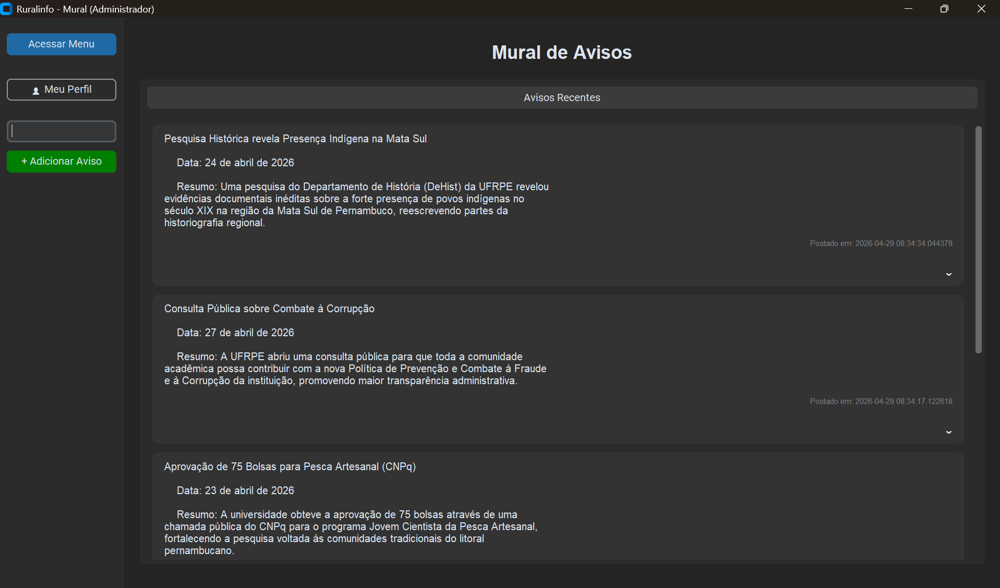

<p align="center">
    <strong>Nome da Aplicação:</strong> Ruralinfo<br>
    <strong>Integrantes:</strong> <a href="https://github.com/DanielMoreiraFr">Daniel Moreira</a>,  <a href="https://github.com/kauefreitasR">Kaue Freitas</a><br>
    <strong>Professor:</strong> [Cleyton Vanut]<br>
    <strong>Disciplina:</strong> Projeto Interdisciplinar para Sistemas de Informação<br>
    <strong>Curso:</strong> Bacharelado em Sistemas de Informação<br>
    <strong>Unidade de Ensino:</strong> Universidade Federal Rural de Pernambuco (UFRPE)<br>
</p>

<p>O Ruralinfo é uma aplicação desktop desenvolvida para centralizar o fluxo de informações no Campus Dois Irmãos da UFRPE. O sistema funciona como um mural digital onde a administração pode gerenciar comunicados, horários de transporte e avisos gerais, garantindo que o corpo discente tenha acesso rápido e seguro aos dados institucionais.</p>

<p align="center">
  
</p>

<h2>Ferramentas Utilizadas</h2>

<table>
    <tr>
        <td> Python 3.14.4</td>
        <td>Linguagem de programação principal</td>
    </tr>
    <tr>
        <td> VSCode</td>
        <td>IDE de desenvolvimento</td>
    </tr>
    <tr>
        <td> Git</td>
        <td>Versionamento de código</td>
    </tr>
    <tr>
        <td> GitHub</td>
        <td>Repositório e cooperação remota</td>
    </tr>
</table>

<h1>VERSÃO 1VA</h1>

<h2>Funcionalidades Implementadas</h2>
<ul>
    <li><strong>1 - Sistema de Autenticação Dual:</strong> Tela unificada para Login e Cadastro com alternância dinâmica de modo.</li>
    <li><strong>2 - Validação Institucional:</strong> Filtro obrigatório para e-mails do domínio <code>@ufrpe.br</code>.</li>
    <li><strong>3 - Segurança de Credenciais:</strong> Validação rigorosa de senhas (mínimo 10 caracteres, letras maiúsculas, números e caracteres especiais).</li>
    <li><strong>4 - Mural Informativo:</strong> Interface para visualização de avisos e comunicados acadêmicos.</li>
    <li><strong>5 - Persistência em SQLite:</strong> Gestão de dados de usuários e avisos com tratamento de transações e <code>Context Managers</code>.</li>
</ul>

<h2>Bibliotecas Utilizadas</h2>
<table>
    <tr>
        <td><strong>CustomTkinter</strong></td>
        <td>Criação de interfaces gráficas modernas com suporte a temas e widgets customizados.</td>
    </tr>
    <tr>
        <td><strong>SQLite3</strong></td>
        <td>Banco de dados relacional leve para armazenamento local de contas e avisos.</td>
    </tr>
    <tr>
        <td><strong>tkinter.messagebox</strong></td>
        <td>Exibição de alertas de erro, sucesso e avisos de validação ao usuário.</td>
    </tr>
    <tr>
        <td><strong>contextlib</strong></td>
        <td>Utilizada no backend para garantir a segurança das conexões com o banco de dados.</td>
    </tr>
</table>

<h2>Instalação e Execução</h2>
<p>O projeto utiliza a biblioteca <strong>CustomTkinter</strong>, que deve ser instalada previamente.</p>

<pre><code>pip install customtkinter</code></pre>

<p>Para executar a aplicação, utilize o comando abaixo na raiz do projeto:</p>
<pre><code>python src/main.py</code></pre>

<h1>VERSÃO 2VA (Planejamento)</h1>

<h2>Funcionalidades Futuras</h2>
<ul>
    <li><strong>6 - Implementação da Rota do Circular:</strong> Mapeamento visual dos trajetos realizados pelo transporte interno da UFRPE.</li>
    <li><strong>7 - Busca do Circular:</strong> Consulta em tempo real (ou via tabela) dos horários previstos de saída e chegada.</li>
    <li><strong>8 - Review Técnico do Ônibus:</strong> Área dedicada para feedback discente sobre as condições de transporte para melhorias institucionais.</li>
    <li><strong>9 - Review Ruralinfo + Sugestões:</strong> Canal direto para feedback sobre a experiência do usuário com o app.</li>
    <li><strong>10 - A definir:</strong> Funcionalidade bônus baseada nas necessidades identificadas durante os testes da 1VA.</li>
</ul>

<h2>Estrutura do Projeto</h2>

```bash
Ruralinfo/
├── src/
│   ├── banco/              # Scripts de conexão e manipulação do SQLite
│   │   ├── banco_infos.py
│   │   ├── banco_usuarios.py
│   │   └── banco.db
│   ├── Interface/          # Camada de visualização (GUI)
│   │   └── entidades/
│   │       ├── infos.py    # Lógica do Mural Informativo
│   │       └── usuarios.py # Lógica de Login e Cadastro (CustomTkinter)
│   ├── utils/              # Funções auxiliares e recursos visuais
│   │   └── texto.py
│   └── main.py             # Ponto de entrada do sistema
├── .gitignore              # Arquivos ignorados pelo Git (venv, .db)
└── README.md